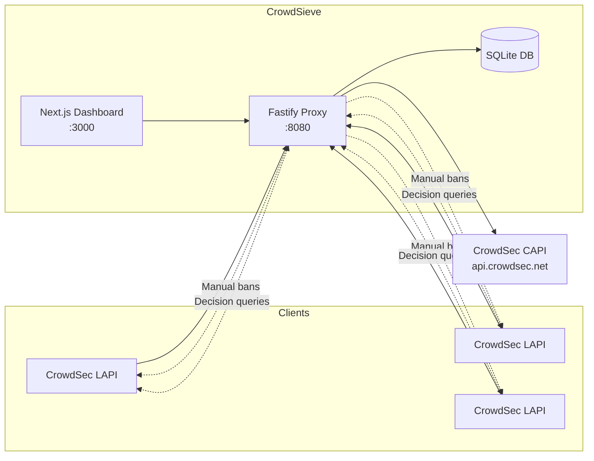

# CrowdSieve

A filtering proxy for CrowdSec that sits between your local CrowdSec instances (LAPI) and the Central API (CAPI). Filter alerts before they're sent to the CrowdSec console, and visualize them in a local dashboard.

## Features

- **Alert Filtering**: Powerful expression-based filter rules with logical operators (and, or, not)
  - Field operators: eq, ne, gt, lt, in, contains, starts_with, ends_with, regex, glob, cidr
  - Combinable conditions for complex filtering logic
- **Client Validation**: Optional validation of CrowdSec clients against CAPI before accepting alerts
- **Dashboard**: Web interface to visualize alerts with GeoIP enrichment
- **Decision Search**: Query active decisions for any IP across all your LAPI servers
- **Manual Bans**: Ban IPs directly from the dashboard, pushing decisions to your local CrowdSec LAPI servers
- **Transparent Proxy**: Forwards non-filtered alerts to CAPI
- **GeoIP Enrichment**: Enrich alerts with geographic information
- **Lightweight**: Docker image under 250MB

## Quick Start

### Using Docker

```bash
# Clone the repository
git clone https://github.com/yourusername/crowdsieve.git
cd crowdsieve

# Start the services (proxy + dashboard)
docker compose up -d

# View logs
docker compose logs -f
```

The container runs both services:

- **Proxy**: http://localhost:8080 (for CrowdSec LAPI)
- **Dashboard**: http://localhost:3000 (web interface)

### Manual Installation

```bash
# Install dependencies
npm install
cd dashboard && npm install && cd ..

# Start in development mode (2 terminals)
npm run dev              # Terminal 1: Proxy on :8080
npm run dev:dashboard    # Terminal 2: Dashboard on :3000

# Build for production
npm run build
npm start
```

## Configuration

### CrowdSec Client Configuration

On each CrowdSec server that should use the proxy, update `/etc/crowdsec/online_api_credentials.yaml`:

```yaml
# Before
url: https://api.crowdsec.net/

# After
url: http://YOUR_PROXY_IP:8080/
```

Then restart CrowdSec:

```bash
sudo systemctl restart crowdsec
```

### Proxy Configuration

Edit `config/filters.yaml`:

```yaml
proxy:
  listen_port: 8080
  capi_url: 'https://api.crowdsec.net'
  timeout_ms: 30000
  forward_enabled: true # Set to false for test mode

storage:
  path: './data/crowdsieve.db'
  retention_days: 30

filters:
  mode: 'block' # "block" = matching alerts NOT forwarded; "allow" = only matching forwarded
  # Rules are loaded from config/filters.d/*.yaml
```

### LAPI Servers (Decisions & Manual Bans)

To view decisions and enable manual IP banning from the dashboard, configure your local CrowdSec LAPI servers:

```yaml
lapi_servers:
  - name: 'server1'
    url: 'http://localhost:8081'
    api_key: 'your-bouncer-api-key'      # For reading decisions
    machine_id: 'crowdsieve'             # For manual banning (optional)
    password: 'your-machine-password'    # For manual banning (optional)
  - name: 'server2'
    url: 'http://192.168.1.10:8080'
    api_key: 'another-bouncer-key'
```

**Bouncer API key** (required): For querying decisions. Generate with:
```bash
cscli bouncers add crowdsieve-dashboard
```

**Machine credentials** (optional): For manual banning from the dashboard. Register a machine with:
```bash
# Interactive (will prompt for password)
cscli machines add crowdsieve

# Or with auto-generated password (note it down for config)
cscli machines add crowdsieve --auto
```

When multiple servers are configured, you can ban an IP on all servers at once or select a specific server. Manual bans use the `crowdsieve/manual` scenario with immediate effect.

### Environment Variables in Config

Sensitive values like passwords and API keys can be loaded from environment variables using the `${VAR_NAME}` syntax:

```yaml
lapi_servers:
  - name: 'server1'
    url: 'http://localhost:8081'
    api_key: '${LAPI_API_KEY}'
    machine_id: '${LAPI_MACHINE_ID:-crowdsieve}'  # With default value
    password: '${LAPI_PASSWORD}'
```

Syntax:
- `${VAR_NAME}` - Replaced with the environment variable value (empty string if not set)
- `${VAR_NAME:-default}` - Replaced with the env var value, or `default` if not set

This is useful for:
- Docker/Kubernetes deployments with secrets
- Keeping sensitive data out of config files
- CI/CD pipelines

### Decision Search

The dashboard includes a **Decisions** page (accessible from the navigation) that lets you search for active decisions on any IP address across all configured LAPI servers.

Features:
- Search by IP address (IPv4 or IPv6)
- Results grouped by server
- Shared decisions (from CAPI/blocklists) are deduplicated and shown separately
- Direct link from alert details to view decisions for the source IP

### Filter Rules

Filter rules are YAML files in `config/filters.d/`. Each rule uses an expression-based syntax:

```yaml
# config/filters.d/00-no-decision.yaml
name: no-decision
enabled: true
description: 'Block alerts without decisions'
filter:
  field: decisions
  op: empty
```

```yaml
# config/filters.d/10-internal-ips.yaml
name: internal-ips
enabled: true
description: 'Block internal IP ranges'
filter:
  field: source.ip
  op: cidr
  value:
    - '10.0.0.0/8'
    - '172.16.0.0/12'
    - '192.168.0.0/16'
```

```yaml
# Complex filter with logical operators
name: complex-filter
enabled: true
filter:
  op: and
  conditions:
    - field: scenario
      op: glob
      value: 'crowdsecurity/*'
    - op: not
      condition:
        field: source.country
        op: in
        value: ['FR', 'DE', 'US']
```

## Filter Operators

| Operator                | Description            |
| ----------------------- | ---------------------- |
| `eq`, `ne`              | Equals / Not equals    |
| `gt`, `gte`, `lt`, `lte`| Numeric comparisons    |
| `in`, `not_in`          | Value in array         |
| `contains`, `not_contains` | String/array contains |
| `starts_with`, `ends_with` | String prefix/suffix |
| `glob`, `regex`         | Pattern matching       |
| `cidr`                  | IP in CIDR range(s)    |
| `empty`, `not_empty`    | Check if empty         |
| `and`, `or`, `not`      | Logical operators      |

## Client Validation

CrowdSieve can optionally validate CrowdSec clients against CAPI before accepting alerts. This prevents unauthorized clients from sending data through the proxy.

Enable via environment variables:

```bash
CLIENT_VALIDATION_ENABLED=true
CLIENT_VALIDATION_CACHE_TTL=604800        # Cache valid clients for 1 week
CLIENT_VALIDATION_CACHE_TTL_ERROR=3600    # Cache on CAPI errors for 1 hour
CLIENT_VALIDATION_FAIL_CLOSED=false       # Set to true to reject when CAPI unavailable
```

Validation uses a dual-layer cache (in-memory LRU + SQLite) for performance.

## Environment Variables

| Variable          | Default                     | Description                                           |
| ----------------- | --------------------------- | ----------------------------------------------------- |
| `CONFIG_PATH`     | `./config/filters.yaml`     | Path to config file                                   |
| `DATABASE_PATH`   | `./data/crowdsieve.db`      | Path to SQLite database                               |
| `GEOIP_DB_PATH`   | `./data/GeoLite2-City.mmdb` | Path to GeoIP database                                |
| `PROXY_PORT`      | `8080`                      | Proxy listen port                                     |
| `DASHBOARD_PORT`  | `3000`                      | Dashboard listen port                                 |
| `LOG_LEVEL`       | `info`                      | Log level (debug, info, warn, error)                  |
| `LOG_FORMAT`      | `json`                      | Log format (json, pretty)                             |
| `FORWARD_ENABLED` | `true`                      | Set to `false` to disable CAPI forwarding (test mode) |
| `CLIENT_VALIDATION_ENABLED` | `false`         | Enable client validation against CAPI                 |
| `CLIENT_VALIDATION_CACHE_TTL` | `604800`      | Cache TTL for validated clients (seconds)             |
| `CLIENT_VALIDATION_FAIL_CLOSED` | `false`     | Reject requests when CAPI is unavailable              |

## GeoIP Database

To enable GeoIP enrichment, download the MaxMind GeoLite2-City database:

1. Create a free account at [MaxMind](https://www.maxmind.com/en/geolite2/signup)
2. Download `GeoLite2-City.mmdb`
3. Place it in `./data/GeoLite2-City.mmdb`

## Development

```bash
# Install dependencies
npm install

# Run tests
npm test

# Run tests with coverage
npm run test:coverage

# Type checking
npm run typecheck

# Linting
npm run lint
```

## Architecture



## License

AGPL-3.0-only
