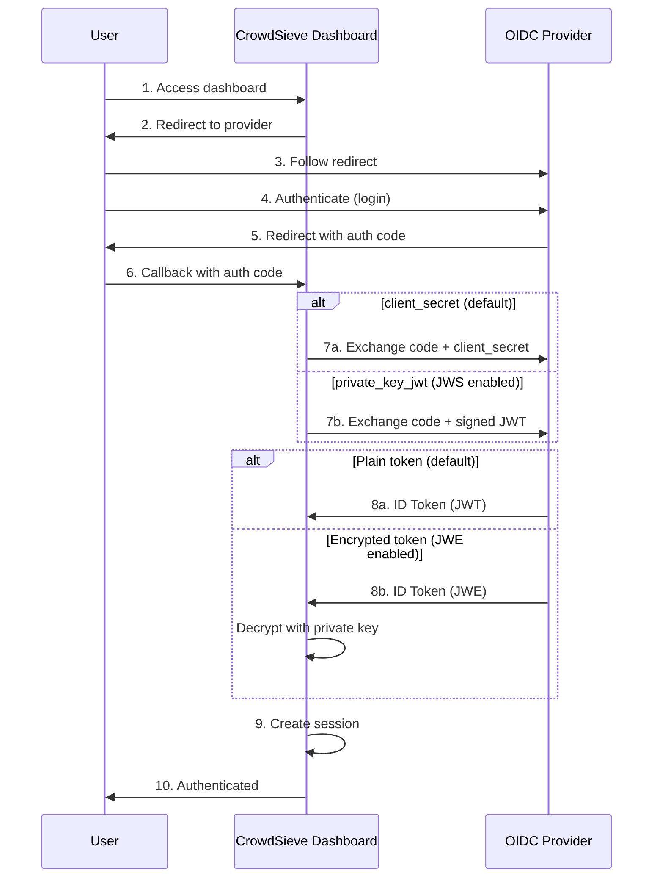

# OIDC Authentication

CrowdSieve supports OpenID Connect (OIDC) authentication for the dashboard. When configured, users must authenticate via an OIDC provider to access the dashboard.

## Overview



## Configuration

### Environment Variables

| Variable                | Required | Default | Description                                             |
| ----------------------- | -------- | ------- | ------------------------------------------------------- |
| `OIDC_ISSUER`           | Yes      | -       | OIDC provider URL (e.g., `https://auth.example.com/`)   |
| `OIDC_CLIENT_ID`        | Yes      | -       | OAuth2 client ID                                        |
| `OIDC_CLIENT_SECRET`    | No\*     | -       | OAuth2 client secret (\*required unless JWS is enabled) |
| `SESSION_SECRET`        | Yes      | -       | Session encryption key (minimum 32 characters)          |
| `SESSION_COOKIE_SECURE` | No       | `true`  | Set to `false` for HTTP-only development                |
| `NEXTAUTH_URL`          | No       | auto    | Base URL for callbacks (auto-detected if not set)       |

Generate secrets with:

```bash
# Session secret
openssl rand -hex 32

# Client secret (if needed)
openssl rand -hex 32
```

### Basic Configuration

```bash
# Required
OIDC_ISSUER=https://auth.example.com/
OIDC_CLIENT_ID=crowdsieve-dashboard
OIDC_CLIENT_SECRET=your-client-secret
SESSION_SECRET=your-32-char-minimum-session-secret

# Optional
SESSION_COOKIE_SECURE=true  # Set to false for HTTP
NEXTAUTH_URL=https://crowdsieve.example.com
```

## Authentication Methods

### Client Secret (Default)

The default authentication method uses a shared secret between CrowdSieve and the OIDC provider.

```bash
OIDC_CLIENT_SECRET=your-client-secret
```

The provider must be configured with:

- Client authentication: `client_secret_post` or `client_secret_basic`

### Private Key JWT (JWS)

For stronger security, use `private_key_jwt` authentication (RFC 7523). CrowdSieve signs a JWT assertion with its private key instead of using a shared secret.

```bash
JWS_ENABLED=true
JWS_KEY_ALG=RS256  # Default, also supports ES256, ES384, ES512
JWE_KEYS_PATH=./data/jwks.json  # Persist keys across restarts
```

**Benefits:**

- No shared secret to manage
- Asymmetric cryptography (more secure)
- Required by some high-security providers

**Provider configuration:**

- Client authentication: `private_key_jwt`
- Import public keys from: `https://crowdsieve.example.com/api/jwks`

> **Note:** When `JWS_ENABLED=true`, `OIDC_CLIENT_SECRET` is **ignored**. A warning is logged if both are configured.

## Token Encryption (JWE)

Enable JWE to decrypt encrypted tokens from the OIDC provider. This provides an additional layer of security by encrypting the ID token and logout token contents.

```bash
JWE_ENABLED=true
JWE_KEY_ALG=RSA-OAEP-256  # Default
JWE_CONTENT_ALGS=A256GCM,A128GCM  # Content encryption algorithms
JWE_KEYS_PATH=./data/jwks.json  # Persist keys across restarts
JWE_KEY_ROTATION_DAYS=30  # Optional: auto-rotate keys
```

**Supported tokens:**

- ID tokens (from authorization code exchange)
- Back-channel logout tokens

**Provider configuration:**

- Enable "Encrypt ID token"
- Import public encryption key from: `https://crowdsieve.example.com/api/jwks`
- Key encryption algorithm: `RSA-OAEP-256`
- Content encryption algorithm: `A256GCM`

## Key Management

When JWS or JWE is enabled, CrowdSieve manages cryptographic keys automatically.

### Key Storage

```bash
JWE_KEYS_PATH=./data/jwks.json
```

**Important:** Always configure `JWE_KEYS_PATH` in production. Without it, keys are regenerated on each restart, invalidating encrypted sessions.

### Key Rotation

```bash
JWE_KEY_ROTATION_DAYS=30  # Rotate every 30 days
```

When rotation is enabled:

- **Signing keys (JWS):** 3 keys are published (next, current, previous) for seamless rotation
- **Encryption keys (JWE):** Current key is published, previous key is kept for decryption

### JWKS Endpoint

Public keys are published at:

```
GET /api/jwks
```

Response format:

```json
{
  "keys": [
    {
      "kty": "RSA",
      "kid": "crowdsieve-sig-...",
      "use": "sig",
      "alg": "RS256",
      "n": "...",
      "e": "AQAB"
    },
    {
      "kty": "RSA",
      "kid": "crowdsieve-enc-...",
      "use": "enc",
      "alg": "RSA-OAEP-256",
      "n": "...",
      "e": "AQAB"
    }
  ]
}
```

## Back-Channel Logout

CrowdSieve supports OIDC Back-Channel Logout for single sign-out. When a user logs out from the OIDC provider, all their sessions across applications are terminated.

**Endpoint:**

```
POST /api/auth/backchannel-logout
Content-Type: application/x-www-form-urlencoded

logout_token=<JWT>
```

**Features:**

- Automatic session revocation
- Support for encrypted logout tokens (JWE)
- Replay attack protection (jti tracking)
- Session-specific or user-wide logout

**Provider configuration:**

- Back-channel logout URL: `https://crowdsieve.example.com/api/auth/backchannel-logout`
- Back-channel logout session required: `ON` (recommended)

## Supported Algorithms

| Type                   | Default        | Supported                                          |
| ---------------------- | -------------- | -------------------------------------------------- |
| JWS Signing            | `RS256`        | RS256, RS384, RS512, ES256, ES384, ES512, EdDSA    |
| JWE Key Encryption     | `RSA-OAEP-256` | RSA-OAEP, RSA-OAEP-256, RSA-OAEP-384, RSA-OAEP-512 |
| JWE Content Encryption | `A256GCM`      | A256GCM, A128GCM, A192GCM                          |

## CrowdSieve Endpoints

Configure these URLs in your OIDC provider:

| Endpoint             | URL                                                          | Description                 |
| -------------------- | ------------------------------------------------------------ | --------------------------- |
| Callback             | `https://crowdsieve.example.com/api/auth/callback/oidc`      | OAuth2 redirect after login |
| JWKS                 | `https://crowdsieve.example.com/api/jwks`                    | Public keys for JWE/JWS     |
| Back-channel Logout  | `https://crowdsieve.example.com/api/auth/backchannel-logout` | SSO logout notification     |
| Post-logout Redirect | `https://crowdsieve.example.com`                             | Redirect after logout       |

## Provider Setup Examples

### LemonLDAP::NG

1. **Create a new OpenID Connect Relying Party** in the Manager:
   - Go to `OpenID Connect Relying Parties` > `Add a new Relying Party`
   - Client ID: `crowdsieve-dashboard`

2. **Configure the Relying Party** in the `Options` tab:

   | Setting                                   | Value                                                   |
   | ----------------------------------------- | ------------------------------------------------------- |
   | Allowed redirection addresses             | `https://crowdsieve.example.com/api/auth/callback/oidc` |
   | Allowed post-logout redirection addresses | `https://crowdsieve.example.com`                        |

3. **Configure authentication** in the `Security` tab:
   - **With client_secret:** Set authentication method to `client_secret_post` or `client_secret_basic`, and set a client secret
   - **With private_key_jwt (JWS):** Set authentication method to `private_key_jwt`, and import public key from `https://crowdsieve.example.com/api/jwks`

4. **Enable Back-channel Logout** (optional):
   - In `Logout` tab, set Back-channel logout URL: `https://crowdsieve.example.com/api/auth/backchannel-logout`

5. **Enable ID Token Encryption** (optional, requires JWE):
   - In `Security` tab, enable "Encrypt ID token"
   - Set ID token encryption algorithm: `RSA-OAEP-256`
   - Set ID token encryption content algorithm: `A256GCM`
   - Import public key from: `https://crowdsieve.example.com/api/jwks`

6. **Issuer URL:** `https://auth.example.com` (your LemonLDAP::NG portal URL)

### Keycloak

1. **Create a new client** in your realm:
   - Client ID: `crowdsieve-dashboard`
   - Client Protocol: `openid-connect`
   - Access Type: `confidential`

2. **Configure URLs** in the client settings:

   | Setting                         | Value                                                   |
   | ------------------------------- | ------------------------------------------------------- |
   | Root URL                        | `https://crowdsieve.example.com`                        |
   | Valid Redirect URIs             | `https://crowdsieve.example.com/api/auth/callback/oidc` |
   | Valid Post Logout Redirect URIs | `https://crowdsieve.example.com`                        |
   | Web Origins                     | `https://crowdsieve.example.com`                        |

3. **Configure authentication** in the Credentials tab:
   - **With client_secret:** Use "Client Id and Secret" and copy the secret
   - **With private_key_jwt (JWS):** Use "Signed JWT", import JWKS from `https://crowdsieve.example.com/api/jwks`

4. **Enable Back-channel Logout** (optional):
   - Back-channel logout URL: `https://crowdsieve.example.com/api/auth/backchannel-logout`
   - Back-channel logout session required: `ON`

5. **Enable ID Token Encryption** (optional, requires JWE):
   - Go to client > Keys tab
   - Enable "Encrypt ID token"
   - Import keys from JWKS URL: `https://crowdsieve.example.com/api/jwks`

6. **Issuer URL:** `https://keycloak.example.com/realms/{realm}`

### Other Providers

| Provider      | Issuer URL Format                                 |
| ------------- | ------------------------------------------------- |
| LemonLDAP::NG | `https://auth.example.com`                        |
| Keycloak      | `https://keycloak.example.com/realms/{realm}`     |
| Auth0         | `https://{tenant}.auth0.com`                      |
| Okta          | `https://{domain}.okta.com`                       |
| Google        | `https://accounts.google.com`                     |
| Azure AD      | `https://login.microsoftonline.com/{tenant}/v2.0` |

## Helm Configuration

For Kubernetes deployments, see the [Helm chart documentation](../helm/crowdsieve/README.md#oidc-authentication).

Basic Helm values:

```yaml
crowdsieve:
  dashboard:
    oidc:
      enabled: true
      issuer: 'https://auth.example.com'
      clientId: 'crowdsieve-dashboard'
      clientSecret: 'your-client-secret'
      session:
        secret: '32-chars-minimum-secret-here!!'
        cookieSecure: true
```

With private_key_jwt (JWS):

```yaml
crowdsieve:
  dashboard:
    oidc:
      enabled: true
      issuer: 'https://auth.example.com'
      clientId: 'crowdsieve-dashboard'
      # No clientSecret - using private_key_jwt
      session:
        secret: '32-chars-minimum-secret-here!!'
      keys:
        jwsEnabled: true
        jwsAlgorithm: 'RS256'
        rotationDays: 30
```

## Troubleshooting

### Common Issues

**"OIDC not configured"**

- Ensure `OIDC_ISSUER`, `OIDC_CLIENT_ID`, and `SESSION_SECRET` are set
- Check that the issuer URL is reachable

**"Invalid redirect URI"**

- Verify the callback URL is registered in your provider: `https://crowdsieve.example.com/api/auth/callback/oidc`

**"Failed to decrypt token"**

- Ensure `JWE_ENABLED=true` and `JWE_KEYS_PATH` is configured
- Verify the provider has imported the correct public key from `/api/jwks`
- Check that the encryption algorithms match

**"Invalid client authentication"**

- If using `private_key_jwt`, ensure `JWS_ENABLED=true`
- Verify the provider has imported the signing key from `/api/jwks`
- Check that the provider is configured for `private_key_jwt` authentication

**Sessions invalidated after restart**

- Configure `JWE_KEYS_PATH` to persist keys
- In Helm, keys are stored at `/app/data/jwks.json` on the PVC

### Debug Logging

Enable debug logging to troubleshoot authentication issues:

```bash
LOG_LEVEL=debug
```

Look for:

- `OIDC: Using private_key_jwt authentication` - JWS is active
- `JWE decryption enabled for OIDC responses` - JWE is active
- `Decrypted encrypted logout token` - JWE logout token processed
- `Back-channel logout: revoked session` - Logout notification received
