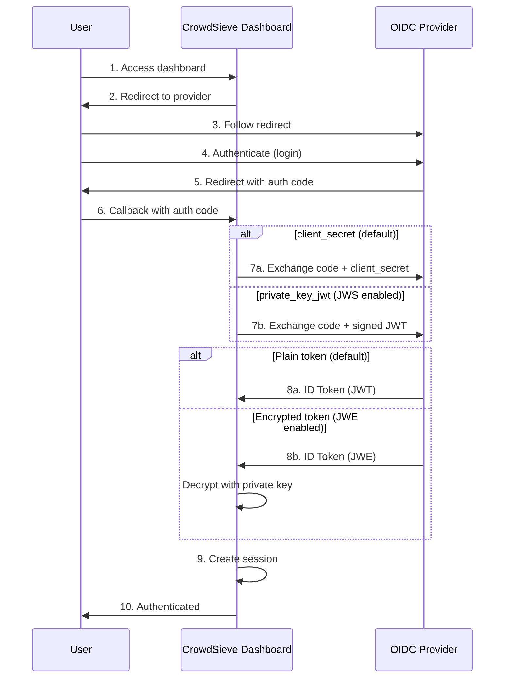

# Authentication

CrowdSieve supports two authentication modes for the dashboard:

| Mode      | When to use                                                                                                                                                                       |
| --------- | --------------------------------------------------------------------------------------------------------------------------------------------------------------------------------- |
| `oidc`    | Standard OpenID Connect deployment. The dashboard handles the login flow itself via the iron-session cookie. Documented in this page.                                             |
| `headers` | A trusted reverse proxy (LemonLDAP-NG handler, NGINX `auth_request`, Apache `mod_auth_*`, etc.) authenticates the user upstream and forwards their identity via `Auth-*` headers. |
| `none`    | No authentication enforced. Default when neither OIDC nor headers mode is configured.                                                                                             |

The mode is selected via `AUTH_MODE` (`oidc` | `headers` | `none`). When unset, the dashboard auto-detects: `oidc` if `OIDC_ISSUER` and `OIDC_CLIENT_ID` are set, otherwise `none`. Jump to [HTTP Headers Mode](#http-headers-mode-lemonldap-ng-handler) for the proxy-based setup.

## OIDC Mode

CrowdSieve supports OpenID Connect (OIDC) authentication for the dashboard. When configured, users must authenticate via an OIDC provider to access the dashboard.

## Overview



## Configuration

### Environment Variables

| Variable                | Required | Default | Description                                                                                                                                                            |
| ----------------------- | -------- | ------- | ---------------------------------------------------------------------------------------------------------------------------------------------------------------------- |
| `AUTH_MODE`             | No       | auto    | `oidc`, `headers`, or `none`. Auto-detects to `oidc` when `OIDC_ISSUER` + `OIDC_CLIENT_ID` are set, otherwise `none`.                                                  |
| `OIDC_ISSUER`           | Yes\*    | -       | OIDC provider URL (e.g., `https://auth.example.com/`). \*Required for OIDC mode.                                                                                       |
| `OIDC_CLIENT_ID`        | Yes\*    | -       | OAuth2 client ID. \*Required for OIDC mode.                                                                                                                            |
| `OIDC_CLIENT_SECRET`    | No\*     | -       | OAuth2 client secret (\*required for OIDC unless JWS is enabled).                                                                                                      |
| `AUTH_ACTOR_CLAIM`      | No       | `sub`   | Claim used as audit-log actor. Any non-empty string (e.g. `sub`, `email`, `name`, `preferredUsername`, `familyName`). Wins over `OIDC_ACTOR_CLAIM` when both are set.   |
| `OIDC_ACTOR_CLAIM`      | No       | `sub`   | Legacy alias for `AUTH_ACTOR_CLAIM`. Kept for back-compat.                                                                                                             |
| `SESSION_SECRET`        | Yes\*    | -       | Session encryption key (minimum 32 characters). \*Required for OIDC mode.                                                                                              |
| `SESSION_COOKIE_SECURE` | No       | `true`  | Set to `false` for HTTP-only development.                                                                                                                              |
| `NEXTAUTH_URL`          | No       | auto    | Base URL for callbacks (auto-detected if not set).                                                                                                                     |
| `TRUSTED_PROXY_IPS`     | No       | -       | (Headers mode only) Comma-separated allowlist of upstream-proxy IPs / IPv4 CIDR ranges. Empty = no IP check.                                                           |
| `AUTH_LOGOUT_URL`       | No       | -       | (Headers mode only) External logout URL the dashboard redirects to when a user clicks "Sign out". When unset, the link is hidden.                                      |
| `AUTH_LOGIN_URL`        | No       | -       | (Headers mode only) External login URL surfaced as a "Go to login portal" button on the headers-mode 401 page.                                                         |

The `AUTH_ACTOR_CLAIM` (or legacy `OIDC_ACTOR_CLAIM`) variable controls which
claim identifies the user that issued or revoked a decision (recorded on every
manual ban and unban event, and on the matching local audit rows persisted in
the alerts table). Defaults to `sub` (always present, stable, opaque). Set to
`email`, `name`, `preferredUsername`, etc. for a more human-readable audit
trail. If the configured claim is missing on the user, the code falls back to
`sub`. Any non-empty string is accepted, which makes this work seamlessly with
claims forwarded by [HTTP Headers Mode](#http-headers-mode-lemonldap-ng-handler)
such as `familyName` or `preferredUsername`.

Generate secrets with:

```bash
# Session secret
openssl rand -hex 32

# Client secret (if needed)
openssl rand -hex 32
```

### Basic Configuration

```bash
# Required
OIDC_ISSUER=https://auth.example.com/
OIDC_CLIENT_ID=crowdsieve-dashboard
OIDC_CLIENT_SECRET=your-client-secret
SESSION_SECRET=your-32-char-minimum-session-secret

# Optional
SESSION_COOKIE_SECURE=true  # Set to false for HTTP
NEXTAUTH_URL=https://crowdsieve.example.com
```

## Authentication Methods

### Client Secret (Default)

The default authentication method uses a shared secret between CrowdSieve and the OIDC provider.

```bash
OIDC_CLIENT_SECRET=your-client-secret
```

The provider must be configured with:

- Client authentication: `client_secret_post` or `client_secret_basic`

### Private Key JWT (JWS)

For stronger security, use `private_key_jwt` authentication (RFC 7523). CrowdSieve signs a JWT assertion with its private key instead of using a shared secret.

```bash
JWS_ENABLED=true
JWS_KEY_ALG=RS256  # Default, also supports ES256, ES384, ES512
JWE_KEYS_PATH=./data/jwks.json  # Persist keys across restarts
```

**Benefits:**

- No shared secret to manage
- Asymmetric cryptography (more secure)
- Required by some high-security providers

**Provider configuration:**

- Client authentication: `private_key_jwt`
- Import public keys from: `https://crowdsieve.example.com/api/jwks`

> **Note:** When `JWS_ENABLED=true`, `OIDC_CLIENT_SECRET` is **ignored**. A warning is logged if both are configured.

## Token Encryption (JWE)

Enable JWE to decrypt encrypted tokens from the OIDC provider. This provides an additional layer of security by encrypting the ID token and logout token contents.

```bash
JWE_ENABLED=true
JWE_KEY_ALG=RSA-OAEP-256  # Default
JWE_CONTENT_ALGS=A256GCM,A128GCM  # Content encryption algorithms
JWE_KEYS_PATH=./data/jwks.json  # Persist keys across restarts
JWE_KEY_ROTATION_DAYS=30  # Optional: auto-rotate keys
```

**Supported tokens:**

- ID tokens (from authorization code exchange)
- Back-channel logout tokens

**Provider configuration:**

- Enable "Encrypt ID token"
- Import public encryption key from: `https://crowdsieve.example.com/api/jwks`
- Key encryption algorithm: `RSA-OAEP-256`
- Content encryption algorithm: `A256GCM`

## Key Management

When JWS or JWE is enabled, CrowdSieve manages cryptographic keys automatically.

### Key Storage

```bash
JWE_KEYS_PATH=./data/jwks.json
```

**Important:** Always configure `JWE_KEYS_PATH` in production. Without it, keys are regenerated on each restart, invalidating encrypted sessions.

### Key Rotation

```bash
JWE_KEY_ROTATION_DAYS=30  # Rotate every 30 days
```

When rotation is enabled:

- **Signing keys (JWS):** 3 keys are published (next, current, previous) for seamless rotation
- **Encryption keys (JWE):** Current key is published, previous key is kept for decryption

### JWKS Endpoint

Public keys are published at:

```
GET /api/jwks
```

Response format:

```json
{
  "keys": [
    {
      "kty": "RSA",
      "kid": "crowdsieve-sig-...",
      "use": "sig",
      "alg": "RS256",
      "n": "...",
      "e": "AQAB"
    },
    {
      "kty": "RSA",
      "kid": "crowdsieve-enc-...",
      "use": "enc",
      "alg": "RSA-OAEP-256",
      "n": "...",
      "e": "AQAB"
    }
  ]
}
```

## Back-Channel Logout

CrowdSieve supports OIDC Back-Channel Logout for single sign-out. When a user logs out from the OIDC provider, all their sessions across applications are terminated.

**Endpoint:**

```
POST /api/auth/backchannel-logout
Content-Type: application/x-www-form-urlencoded

logout_token=<JWT>
```

**Features:**

- Automatic session revocation
- Support for encrypted logout tokens (JWE)
- Replay attack protection (jti tracking)
- Session-specific or user-wide logout

**Provider configuration:**

- Back-channel logout URL: `https://crowdsieve.example.com/api/auth/backchannel-logout`
- Back-channel logout session required: `ON` (recommended)

## Supported Algorithms

| Type                   | Default        | Supported                                          |
| ---------------------- | -------------- | -------------------------------------------------- |
| JWS Signing            | `RS256`        | RS256, RS384, RS512, ES256, ES384, ES512, EdDSA    |
| JWE Key Encryption     | `RSA-OAEP-256` | RSA-OAEP, RSA-OAEP-256, RSA-OAEP-384, RSA-OAEP-512 |
| JWE Content Encryption | `A256GCM`      | A256GCM, A128GCM, A192GCM                          |

## CrowdSieve Endpoints

Configure these URLs in your OIDC provider:

| Endpoint             | URL                                                          | Description                 |
| -------------------- | ------------------------------------------------------------ | --------------------------- |
| Callback             | `https://crowdsieve.example.com/api/auth/callback/oidc`      | OAuth2 redirect after login |
| JWKS                 | `https://crowdsieve.example.com/api/jwks`                    | Public keys for JWE/JWS     |
| Back-channel Logout  | `https://crowdsieve.example.com/api/auth/backchannel-logout` | SSO logout notification     |
| Post-logout Redirect | `https://crowdsieve.example.com`                             | Redirect after logout       |

## Provider Setup Examples

### LemonLDAP::NG

1. **Create a new OpenID Connect Relying Party** in the Manager:
   - Go to `OpenID Connect Relying Parties` > `Add a new Relying Party`
   - Client ID: `crowdsieve-dashboard`

2. **Configure the Relying Party** in the `Options` tab:

   | Setting                                   | Value                                                   |
   | ----------------------------------------- | ------------------------------------------------------- |
   | Allowed redirection addresses             | `https://crowdsieve.example.com/api/auth/callback/oidc` |
   | Allowed post-logout redirection addresses | `https://crowdsieve.example.com`                        |

3. **Configure authentication** in the `Security` tab:
   - **With client_secret:** Set authentication method to `client_secret_post` or `client_secret_basic`, and set a client secret
   - **With private_key_jwt (JWS):** Set authentication method to `private_key_jwt`, and import public key from `https://crowdsieve.example.com/api/jwks`

4. **Enable Back-channel Logout** (optional):
   - In `Logout` tab, set Back-channel logout URL: `https://crowdsieve.example.com/api/auth/backchannel-logout`

5. **Enable ID Token Encryption** (optional, requires JWE):
   - In `Security` tab, enable "Encrypt ID token"
   - Set ID token encryption algorithm: `RSA-OAEP-256`
   - Set ID token encryption content algorithm: `A256GCM`
   - Import public key from: `https://crowdsieve.example.com/api/jwks`

6. **Issuer URL:** `https://auth.example.com` (your LemonLDAP::NG portal URL)

### Keycloak

1. **Create a new client** in your realm:
   - Client ID: `crowdsieve-dashboard`
   - Client Protocol: `openid-connect`
   - Access Type: `confidential`

2. **Configure URLs** in the client settings:

   | Setting                         | Value                                                   |
   | ------------------------------- | ------------------------------------------------------- |
   | Root URL                        | `https://crowdsieve.example.com`                        |
   | Valid Redirect URIs             | `https://crowdsieve.example.com/api/auth/callback/oidc` |
   | Valid Post Logout Redirect URIs | `https://crowdsieve.example.com`                        |
   | Web Origins                     | `https://crowdsieve.example.com`                        |

3. **Configure authentication** in the Credentials tab:
   - **With client_secret:** Use "Client Id and Secret" and copy the secret
   - **With private_key_jwt (JWS):** Use "Signed JWT", import JWKS from `https://crowdsieve.example.com/api/jwks`

4. **Enable Back-channel Logout** (optional):
   - Back-channel logout URL: `https://crowdsieve.example.com/api/auth/backchannel-logout`
   - Back-channel logout session required: `ON`

5. **Enable ID Token Encryption** (optional, requires JWE):
   - Go to client > Keys tab
   - Enable "Encrypt ID token"
   - Import keys from JWKS URL: `https://crowdsieve.example.com/api/jwks`

6. **Issuer URL:** `https://keycloak.example.com/realms/{realm}`

### Other Providers

| Provider      | Issuer URL Format                                 |
| ------------- | ------------------------------------------------- |
| LemonLDAP::NG | `https://auth.example.com`                        |
| Keycloak      | `https://keycloak.example.com/realms/{realm}`     |
| Auth0         | `https://{tenant}.auth0.com`                      |
| Okta          | `https://{domain}.okta.com`                       |
| Google        | `https://accounts.google.com`                     |
| Azure AD      | `https://login.microsoftonline.com/{tenant}/v2.0` |

## Helm Configuration

For Kubernetes deployments, see the [Helm chart documentation](../helm/crowdsieve/README.md#oidc-authentication).

Basic Helm values:

```yaml
crowdsieve:
  dashboard:
    oidc:
      enabled: true
      issuer: 'https://auth.example.com'
      clientId: 'crowdsieve-dashboard'
      clientSecret: 'your-client-secret'
      session:
        secret: '32-chars-minimum-secret-here!!'
        cookieSecure: true
```

With private_key_jwt (JWS):

```yaml
crowdsieve:
  dashboard:
    oidc:
      enabled: true
      issuer: 'https://auth.example.com'
      clientId: 'crowdsieve-dashboard'
      # No clientSecret - using private_key_jwt
      session:
        secret: '32-chars-minimum-secret-here!!'
      keys:
        jwsEnabled: true
        jwsAlgorithm: 'RS256'
        rotationDays: 30
```

## Troubleshooting

### Common Issues

**"OIDC not configured"**

- Ensure `OIDC_ISSUER`, `OIDC_CLIENT_ID`, and `SESSION_SECRET` are set
- Check that the issuer URL is reachable

**"Invalid redirect URI"**

- Verify the callback URL is registered in your provider: `https://crowdsieve.example.com/api/auth/callback/oidc`

**"Failed to decrypt token"**

- Ensure `JWE_ENABLED=true` and `JWE_KEYS_PATH` is configured
- Verify the provider has imported the correct public key from `/api/jwks`
- Check that the encryption algorithms match

**"Invalid client authentication"**

- If using `private_key_jwt`, ensure `JWS_ENABLED=true`
- Verify the provider has imported the signing key from `/api/jwks`
- Check that the provider is configured for `private_key_jwt` authentication

**Sessions invalidated after restart**

- Configure `JWE_KEYS_PATH` to persist keys
- In Helm, keys are stored at `/app/data/jwks.json` on the PVC

### Debug Logging

Enable debug logging to troubleshoot authentication issues:

```bash
LOG_LEVEL=debug
```

Look for:

- `OIDC: Using private_key_jwt authentication` - JWS is active
- `JWE decryption enabled for OIDC responses` - JWE is active
- `Decrypted encrypted logout token` - JWE logout token processed
- `Back-channel logout: revoked session` - Logout notification received

## HTTP Headers Mode (LemonLDAP-NG handler)

Some deployments sit behind a "handler" reverse proxy (LemonLDAP-NG, NGINX `auth_request`, Apache `mod_auth_*`, Traefik ForwardAuth, etc.) that performs authentication upstream and forwards the user's identity to the protected app via HTTP headers. CrowdSieve supports this model via `AUTH_MODE=headers`.

> **Critical security requirement:** the dashboard MUST be unreachable except via the trusted upstream proxy. Headers mode trusts every `Auth-*` header it receives — if a client can reach the dashboard directly, they can spoof any identity. Use network isolation (Kubernetes NetworkPolicy, firewall rules, listening on `127.0.0.1`, etc.) and optionally `TRUSTED_PROXY_IPS` for defense in depth.

### Quick start

```bash
AUTH_MODE=headers
# Optional: only accept requests from these source IPs / IPv4 CIDR ranges.
# When unset, no IP check is performed (rely on network isolation).
TRUSTED_PROXY_IPS=10.0.0.5,10.42.0.0/16
# Optional: where to send the user when they click "Sign out".
# When unset, the Sign-out link is hidden.
AUTH_LOGOUT_URL=https://portal.example.com/logout
# Optional: shown on the dashboard's 401 page as a "Go to login portal" button.
AUTH_LOGIN_URL=https://portal.example.com/
# Optional: which claim to use as the audit-log actor (defaults to "sub").
AUTH_ACTOR_CLAIM=preferredUsername
```

### Header convention

Identity is forwarded as `Auth-<Field>` headers. The dashboard maps each `Auth-Foo-Bar-Baz` header to a `fooBarBaz` claim on the SessionUser:

| Header                    | Claim               | Notes                                    |
| ------------------------- | ------------------- | ---------------------------------------- |
| `Auth-Sub`                | `sub`               | **Required.** Stable, opaque user id.    |
| `Auth-Email`              | `email`             | Optional.                                |
| `Auth-Name`               | `name`              | Optional, full display name.             |
| `Auth-Family-Name`        | `familyName`        | Optional.                                |
| `Auth-Given-Name`         | `givenName`         | Optional.                                |
| `Auth-Picture`            | `picture`           | Optional. Only `http://` / `https://` accepted. |
| `Auth-Preferred-Username` | `preferredUsername` | Optional, useful as `AUTH_ACTOR_CLAIM`.  |
| `Auth-<Anything>`         | `<camelCase>`       | Any custom field. `Auth-Foo-Bar-Baz` → `fooBarBaz`. |

Mapping rule: strip the `auth-` prefix (case-insensitive), then convert the remaining kebab-case suffix to camelCase. Header values are trimmed, stripped of CR/LF, and capped at 1024 characters as a defensive measure.

### Behavior

- A request **without** a non-empty `Auth-Sub` header is rejected with HTTP **401**.
- When `TRUSTED_PROXY_IPS` is set, a request from any other source IP is rejected with HTTP **403** before headers are even inspected.
- The login page (`/login`) renders a static "Authentication required" UI. The dashboard does **not** initiate a login flow — that is the upstream proxy's responsibility.
- The "Sign out" link in the user menu is hidden unless `AUTH_LOGOUT_URL` is configured. When it is, clicking the link redirects the user to that URL (typically the proxy's logout endpoint).
- Sessions are **stateless**: there is no iron-session cookie, no server-side session store. Every request re-validates against the headers it carries.
- The audit-log actor (`X-Crowdsieve-Actor` forwarded to the backend on bans/unbans) follows the configured `AUTH_ACTOR_CLAIM`. With headers mode you can use any claim you forward, e.g. `preferredUsername` or `email`.

### Example: LemonLDAP-NG handler

In the LemonLDAP-NG manager, configure a "Virtual Host" pointing at the dashboard with a handler-style protection rule:

```
# Headers (Manager > Virtual Hosts > <crowdsieve.example.com> > Headers)
Auth-Sub                = $uid
Auth-Email              = $mail
Auth-Name               = $cn
Auth-Family-Name        = $sn
Auth-Given-Name         = $givenName
Auth-Preferred-Username = $uid
```

Then point your reverse proxy (NGINX, Apache, etc.) at the LemonLDAP-NG handler and forward to the CrowdSieve dashboard. See the [LemonLDAP-NG documentation](https://lemonldap-ng.org/documentation/latest/) for the canonical setup.

### Example: NGINX `auth_request`

```nginx
server {
  listen 443 ssl;
  server_name crowdsieve.example.com;

  # Forward auth to the upstream identity verifier.
  location = /_auth {
    internal;
    proxy_pass https://auth.example.com/check;
    proxy_pass_request_body off;
    proxy_set_header Content-Length "";
    proxy_set_header X-Original-URI $request_uri;
  }

  location / {
    auth_request /_auth;
    # Capture identity headers from the auth response.
    auth_request_set $auth_sub   $upstream_http_auth_sub;
    auth_request_set $auth_email $upstream_http_auth_email;
    auth_request_set $auth_name  $upstream_http_auth_name;

    # Forward them to the dashboard.
    proxy_set_header Auth-Sub   $auth_sub;
    proxy_set_header Auth-Email $auth_email;
    proxy_set_header Auth-Name  $auth_name;

    proxy_pass http://crowdsieve-dashboard:3000;
  }
}
```

### Trusted-proxy IP gating

`TRUSTED_PROXY_IPS` is a comma-separated allowlist applied to the immediate caller of the dashboard:

| Entry format            | Match semantics                                                                          |
| ----------------------- | ---------------------------------------------------------------------------------------- |
| `10.0.0.5`              | Exact IPv4.                                                                              |
| `10.0.0.0/16`           | IPv4 CIDR.                                                                               |
| `2001:db8::1`           | Exact IPv6 (IPv6 CIDRs are matched as exact strings only in v1).                          |
| `::ffff:10.0.0.1`       | IPv4-mapped IPv6, normalized to the IPv4 form for comparison against IPv4/IPv4-CIDR entries. |

The client IP is resolved in this order:

1. The Next.js `NextRequest.ip` field, if present.
2. The first non-empty entry of the `X-Forwarded-For` header.
3. The `X-Real-IP` header.

When `TRUSTED_PROXY_IPS` is unset, no IP check is performed — operators are expected to ensure the dashboard is unreachable except via the proxy.
