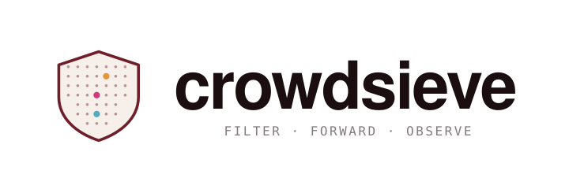
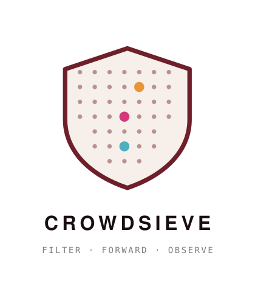
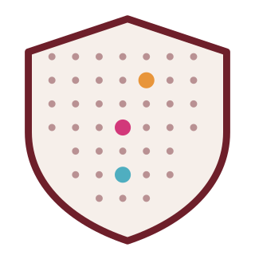

# CrowdSieve branding

Logo and visual identity assets for CrowdSieve. These files are intended for
documentation, press, blog posts, conference talks, and community-built
integrations. Please don't alter the artwork (no recolouring, distortion or
re-typesetting).

## Variants

### Horizontal lockup

Default variant — mark + wordmark, optimised for headers, README banners,
slide titles.

  

[`assets/crowdsieve-lockup-horizontal.svg`](./assets/crowdsieve-lockup-horizontal.svg)

### Vertical lockup

Use when horizontal real estate is constrained (sidebars, mobile splash
screens, social-media avatars with title).

  

[`assets/crowdsieve-lockup-vertical.svg`](./assets/crowdsieve-lockup-vertical.svg)

### Mark only

The shield mark on its own — favicon, app icon, contextual badge inside
existing UI where the wordmark is already present elsewhere on the page.

  

[`assets/crowdsieve-mark.svg`](./assets/crowdsieve-mark.svg)

## Sponsor

CrowdSieve is developed and maintained by [Linagora](https://www.linagora.com).

  

[`assets/linagora.png`](./assets/linagora.png)
